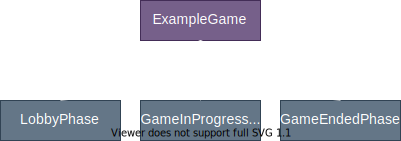
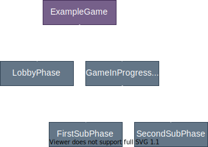
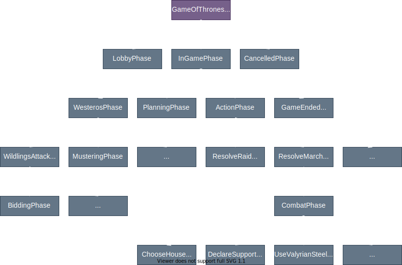

Phases are a tool to model the structure in which some games requires different inputs from the players, depending on the progress of the game. Phases represent a certain section of your game, containing its own state on top of the `Game` state, and define its own `applyAction` method used to handle the actions specific to this section.

Phases can also be used to create a _lobby_ phase before the beginning of the game (to allow for the owner of the game to modify the settings of the game, for example).

## Defining phases

To define the phases of your game:

* Create a class extending `Phase` for each of the phases of your game.
* For each of them, define an `id` property.
* Define the property `childPhaseClasses` in your `Game`, with the list of possible child Phases.

For example, a game with 3 phases would be defined this way:

```js
class LobbyPhase extends Phase { /* ... */ }
LobbyPhase.id = "lobby";

class GameInProgressPhase extends Phase { /* ... */ }
GameInProgressPhase.id = "game-in-progress";

class GameEndedPhase extends Phase { /* ... */ }
GameEndedPhase.id = "game-ended";

class ExampleGame extends Game { /* ... */ }
ExampleGame.childPhaseClasses = [LobbyPhase, GameInProgressPhase, GameEndedPhase];
```

One could visualize the different phases as a tree of phases, with our `Game` at the top. The phase tree for the game defined above would be:



At any point, the game would be in a certain phase, which could be either `LobbyPhase`, `GameInProgressPhase` or `GameEndedPhase`. The current phase could contain some state, if necessary, to store data necessary for this state of the game. When an action is sent by a player, both the `applyAction` method of `Game` and `Phase` are called (in this order respectively).

### Initializing the first phase

To initialize the first phase, use the `this.setChild` function inside the `initialize` function of your game:

```js {3}
class ExampleGame extends Game {
    initialize() {
        this.setChild(LobbyPhase);
    }
}
```

This will set the current phase to `LobbyPhase`, and call the `initialize` method of it.

### Switching between phases

To switch between phases, use the `setChild` function of `Game`. The `Game` instance can be accessed from a `Phase` by using `this.parent`.

```js {4}
class LobbyPhase extends Phase {
    applyAction(playerId, action) {
        if (action.type == "start") {
            this.parent.setChild(GameInProgressPhase);
        }
    }
}
```

### Initialization with arguments

When calling `setChild`, arguments can be passed. Those argumets will be passed down to the `initialize` method of the new phase. For example:

```js {6,12-17}
class GameInProgressPhase extends Phase {
    applyAction(playerId, action) {
        if (action.type == "win-the-game") {
            // playerId will be sent to the initialize
            // method of GameEndedPhase
            this.parent.setChild(GameEndedPhase, playerId);
        }
    }
}

class GameEndedPhase extends Phase {
    initialize(playerId) {
        // Save the playerId in the state of the phase
        this.state = {
            playerId: playerId
        }
    }
}
```

## Nested Phases

Phases can be nested, to allow complex gameflow to be modelled. Let's say we want to create this phase tree:



This would be done like this:

```js
class LobbyPhase extends Phase { /* ... */}
LobbyPhase.id = "lobby";

class FirstSubPhase extends Phase { /* ... */ }
FirstSubPhase.id = "first-sub";

class SecondSubPhase extends Phase { /* ... */ }
SecondSubPhase.id = "second-sub";

class GameInProgressPhase extends Phase { /* ... */ }
GameInProgressPhase.id = "game-in-progress";
GameInProgressPhase.childPhaseClasses = [FirstSubPhase, SecondSubPhase];

class ExampleGame extends Game { /* ... */ }
ExampleGame.childPhaseClasses = [LobbyPhase, GameInProgressPhase, GameEndedPhase];
```

To set the child phase of a phase, use the `this.setChild` method of `Phase`, much in the same way that it is done for `Game`:

```js {3}
class GameInProgressPhase extends Phase {
    initialize() {
        this.setChild(FirstSubPhase);
    }
}
```

When an action needs to be handled, Ravens will travel down the tree, calling the `applyAction` method of each phases. 

## Example of a complex phase tree

The phase tree architecture can be a great tool to model complex games. As an example, you can find below a portion of the phase tree for the game _A Game of Thrones: The Board Game_, that I implemented for the project [Swords and Ravens](https://swordsandravens.net/).



Each of this phase asks a different action from the players, or sometimes from only a subset of the players. The phase architecture is critical to properly handle the complexity of some turn-based games.

:::info
The similarity in the names between _Swords and Ravens_ and _Ravens_ is not accidental. It's while coding S&R that I realized that it could be possible to create a library to help developping online turn-based games. Thus, _Ravens_ was born.
:::